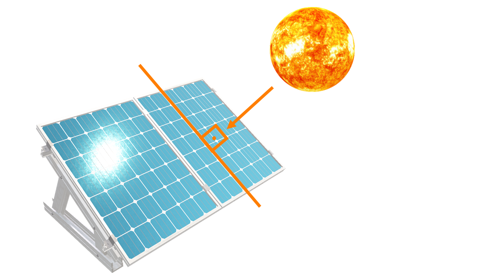

class: inverse


```{r, results = 'asis', echo = F, warning = F, message = F, error = F, fig.align ='center'}


library(xaringanExtra)
library(xaringanthemer)


style_mono_accent(base_color = "#1c5253",
                  text_font_size = '30px',
                  header_h1_font_size = '3rem',
                  header_h2_font_size = '2rem',
                  header_h3_font_size = '1.5rem')


use_scribble()
use_search(show_icon = TRUE)


```


# AGENDA 


- [**.white[VISÃO GERAL]**](#visao_geral)


- [**.white[MERCADO FOTOVOLTAICO NO BRASIL]**](#mercado_fotovoltaico_brasil)


- [**.white[ASPECTOS REGULATÓRIOS]**](#aspectos_regulatorios)


- [**.white[MATEMÁTICA FINANCEIRA]**](#matematica_financeira)


- [**.white[ANÁLISE DE INVESTIMENTOS]**](#analise_investimento)


- [**.white[ESTUDOS DE CASOS]**](#estudos_casos)


---
class: inverse, middle, center
name: visao_geral


# VISÃO GERAL


---
<div style="text-align: justify">
# VISÃO GERAL


- Esta apresentação tem por **OBJETIVO GERAL** explicar como realizar uma 
**ANÁLISE FINANCEIRA DE INVESTIMENTOS** em sistemas fotovoltaicos de maneira 
correta e robusta.


- Os responsáveis técnicos devem compreender que a decisão de instalação de um 
sistema fotovoltaico é econômica. Isto é, projetos **TECNICAMENTE VIÁVEIS**
apenas deverão ser implementados se forem **FINANCEIRAMENTE VIÁVEIS**.


---
<div style="text-align: justify">
# VISÃO GERAL


- Ao contrário do que se imagina (e se pratica!) realizar uma análise financeira 
de investimentos em sistemas fotovoltaicos **NÃO É TAREFA FÁCIL**, visto que, 
**CONCEITOS TÉCNICOS** devem ser **ASSOCIADOS a CONCEITOS ECONÔMICOS**.


- Nesta edição do curso, a seção de finanças foi alterada de modo que o estudante
seja capaz de **INTERPRETAR UMA ANÁLISE FINANCEIRA** de investimentos 
em diversos contextos a partir de um aplicativo desenvolvido pelo professor.


---
<div style="text-align: justify">
# VISÃO GERAL

</br>


- Faremos aqui um guia “passo a passo” de como utilizar o aplicativo para 
implementar e interpretar uma análise financeira no contexto desejado. 
A ideia é que você crie **INDEPENDÊNCIA** para elaborar as suas análises de 
acordo com as especificidades do seu projeto. 


---
class: inverse, middle, center
name: mercado_fotovoltaico_brasil


# MERCADO FOTOVOLTAICO NO BRASIL


---
<div style="text-align: justify">
# MERCADO FOTOVOLTAICO NO BRASIL


- O Brasil possui um cenário promissor para o mercado de energia fotovoltaica.
Como se sabe, nosso país possui vasta disponibilidade de recurso solar;

  - A soma anual de irradiação global em qualquer lugar no **BRASIL** 
  encontra-se no intervalo de **1.500 kWh/m² à 2.500 kWh/m²**.


- Portanto, nossa irradiação é muito maior que países referência no setor;

  - A soma anual de irradiação global em qualquer lugar no **ALEMANHA** 
  encontra-se no intervalo de **900 kWh/m² à 1.250 kWh/m²**.


---
<div style="text-align: justify">
# MERCADO FOTOVOLTAICO NO BRASIL


</br>


**MAPA**


---
<div style="text-align: justify">
# MERCADO FOTOVOLTAICO NO BRASIL


- Apesar da vasta disponibilidade do recurso solar, a indústria fotovoltaica 
ainda é **POUCO DESENVOLVIDA** no país;


- Este atraso na indústria nacional pode ser explicado pela **SUBUTILIZAÇÃO**
da fonte fotovoltaica devido, por sua vez, a **FALTA DE POLÍTICAS 
GOVERNAMENTAIS** até o início da década de 2010;


- O entendimento até então era de que a energia solar fotovoltaica correspondia 
a uma fonte complementar, consistente apenas em contextos de pequenos 
**SISTEMAS ISOLADOS**.


---
<div style="text-align: justify">
# MERCADO FOTOVOLTAICO NO BRASIL


- PROGRAMAS DE INCENTIVO À UTILIZAÇÃO DE ENERGIA FOTOVOLTAICA NO BRASIL

  - Chamada pública n° 13/2011 da Aneel – “Projeto Estratégico Arranjos Técnicos
  e Comerciais para Inserção da Geração Solar Fotovoltaica na Matriz Energética 
  Brasileira”;

  - **RESULTADO**: Aproximadamente 395 milhões de reais foram investidos em 18 
  projetos diferentes, representando uma expansão de potência instalada no Brasil 
  próxima a 24,6 MW.


---
<div style="text-align: justify">
# MERCADO FOTOVOLTAICO NO BRASIL


- PROGRAMAS DE INCENTIVO À UTILIZAÇÃO DE ENERGIA FOTOVOLTAICA NO BRASIL

  - 6º leilão de energia de reserva organizados pela ANEEL e operacionalizados 
  pela CCEE em 31 de outubro de 2014;

  - 7º leilão de energia de reserva organizados pela ANEEL e operacionalizados 
  pela CCEE em 28 de setembro de 2015.


---
<div style="text-align: justify">
# MERCADO FOTOVOLTAICO NO BRASIL


```{r , results = 'asis', echo = F, warning = F, message = F, error = F, fig.align ='center'}


library(magrittr)
library(kableExtra)


leiloes <- data.frame(
  
  resultados = c('Número de empreendimentos cadastrados',
                 'Número de empreendimentos habilitados',
                 'Potência nominal contratada (MW)',
                 'Garantia física contratada (MWmédio)',
                 'Preço inicial de venda de energia (R$/MWh)',
                 'Preço final de venda de energia (R$/MWh)'),
  sexto = c('400','331','889,7','202,3','262','215,1'),
  setimo = c('382','341','833,8','232,9','349','301,8'))


knitr::kable(leiloes, 
             escape = FALSE,
             format = 'html',
             align = c('c', 'c', 'c'),
             col.names = c('RESULTADOS', 
                           '6º LEILÃO', 
                           '7º LEILÃO')) %>%
  
  kable_styling(bootstrap_options = 'striped')


```


### Fonte: ANEEL.


---
<div style="text-align: justify">
# MERCADO FOTOVOLTAICO NO BRASIL


- Todos estes programas foram muito importantes para a inserção da fonte 
fotovoltaica na matriz energética brasileira uma vez que:

  - Geraram desenvolvimento do **MERCADO FOTOVOLTAICO** ao desenvolver toda a 
  cadeia de produção;
  
  - Geraram **DESENVOLVIMENTO TÉCNICO** nos contextos acadêmicos e comerciais.

---
<div style="text-align: justify">
# MERCADO FOTOVOLTAICO NO BRASIL


- Contudo, o marco regulatório que efetivamente abriu o mercado de geração solar 
fotovoltaica residencial e comercial foi definido pela publicação da **RESOLUÇÃO
NORMATIVA Nº 482/2012** que estabelecia os parâmetros de **ACESSO**, **CONEXÃO**, 
**SEGURANÇA** e **TARIFAÇÃO** da **GERAÇÃO DISTRIBUÍDA**;


- Deve-se ressaltar que a Resolução Normativa n° 482/2012 não tratava apenas da 
fonte fotovoltaica, mas da geração distribuída de pequeno porte a partir das 
demais fontes renováveis, tais como a hidráulica (pch), a eólica, a biomassa e a 
cogeração qualificada. 


---
<div style="text-align: justify">
# MERCADO FOTOVOLTAICO NO BRASIL


- Mesmo assim, energia solar fotovoltaica possui a maior representação na 
geração distribuída no Brasil, visto que, corresponde à 99,62% do total de 
conexões à rede elétrica nesta modalidade, 89,88% do total de consumidores 
atendidos e 85,93% do total de potência nominal instalada:

  - Usinas: 78.805;

  - Unidades Consumidoras: 98.548;

  - Potência Instalada: 820.390,18 kWp.


- De fato, o mercado fotovoltaico apresenta um crescimento acelerado


---
<div style="text-align: justify">
# MERCADO FOTOVOLTAICO NO BRASIL


</br>

**GRÁFICO**


---
<div style="text-align: justify">
# MERCADO FOTOVOLTAICO NO BRASIL


</br>

**GRÁFICO**


---
<div style="text-align: justify">
# MERCADO FOTOVOLTAICO NO BRASIL


</br>

**GRÁFICO**


---
<div style="text-align: justify">
# MERCADO FOTOVOLTAICO NO BRASIL


- Existem diversas formas de atuação neste mercado em expansão e, na seção de 
estudos de caso, buscaremos avaliar a viabilidade econômica de algumas 
transações do mercado fotovoltaico;


- Porém, deve-se antes apresentar os principais aspectos da **RESOLUÇÃO NORMATIVA 
N° 482/2012** e de suas alterações, isto é, a **RESOLUÇÃO NORMATIVA Nº
687/2015** e a **LEI Nº 14.300/2022**.


---
class: inverse, middle, center
name: aspectos_regulatorios


# ASPECTOS REGULATÓRIOS


---
<div style="text-align: justify">
# ASPECTOS REGULATÓRIOS


**RESOLUÇÃO NORMATIVA Nº 482/2012**


- A Resolução Normativa n° 482/2012 normatizou os parâmetros da geração 
distribuída. No que se refere a categorização de geração, definiu-se por:

  - **MICROGERAÇÃO**: sistemas geradores com potência nominal instalada de até 
  **100 kW**;

  - **MINIGERAÇÃO**: sistemas geradores com potência nominal instalada entre 
  **100 kW e 1 MW**.


---
<div style="text-align: justify">
# ASPECTOS REGULATÓRIOS


**RESOLUÇÃO NORMATIVA Nº 482/2012**


- **REGIME DE COMPENSAÇÃO**: sistema de compensação de energia elétrica (em inglês, 
**_NET METERING_**). O medidor de energia registra a quantidade de 
energia consumida e produzida, sendo apurado o saldo ao final do **MÊS**.


---
<div style="text-align: justify">
# ASPECTOS REGULATÓRIOS


**RESOLUÇÃO NORMATIVA Nº 482/2012**


- **Art. 2 - III**: _sistema de compensação de energia elétrica: sistema no qual
a **ENERGIA ATIVA INJETADA** por unidade consumidora com microgeração ou 
minigeração distribuída é cedida, por meio de empréstimo gratuito, à 
distribuidora local e posteriormente compensada com o **CONSUMO DE ENERGIA 
ELÉTRICA ATIVA**._


---
<div style="text-align: justify">
# ASPECTOS REGULATÓRIOS


**RESOLUÇÃO NORMATIVA Nº 482/2012**


- REGIME DE COMPENSAÇÃO:

  - $Quantidade \ Consumida > Quantidade \ Produzida \implies$ 
  $Pagamento = Quantidade \ Consumida - Quantidade \ Produzida$

  - $Quantidade \ Produzida > Quantidade \ Consumida \implies$
  $Crédito = Quantidade \ Produzida - Quantidade \ Consumida$


- **OBSERVAÇÃO**: Em caso de saldo positivo (geração de créditos de 
energia a ser compensado), estipulou-se um prazo de **36 MESES** para utilização. 


---
<div style="text-align: justify">
# ASPECTOS REGULATÓRIOS


**RESOLUÇÃO NORMATIVA Nº 482/2012**


- **REGIME DE COMPENSAÇÃO**: Independente do saldo entre as quantidades consumidas 
e produzidas por uma unidade consumidora que possui um sistema fotovoltaico 
instalado, estabeleceu-se um mínimo a ser pago e, de acordo com a modalidade 
tarifária, estabeleceu-se um fator de ajuste de acordo com o posto tarifário. 


---
<div style="text-align: justify">
# ASPECTOS REGULATÓRIOS


**RESOLUÇÃO NORMATIVA Nº 482/2012**


- **Art. 7 - III**: _No faturamento de unidade consumidora integrante do 
sistema de compensação de energia elétrica deverão ser observados os seguintes 
procedimentos: deverá ser cobrado, no mínimo, o valor referente ao **CUSTO DE 
DISPONIBILIDADE** para o consumidor do **GRUPO B**, ou da **DEMANDA 
CONTRATADA** para o consumidor do **GRUPO A**, conforme o caso._


---
<div style="text-align: justify">
# ASPECTOS REGULATÓRIOS


**RESOLUÇÃO NORMATIVA Nº 482/2012**


- **Art. 7 - XI**: _em cada unidade consumidora participante do sistema de 
compensação de energia elétrica, a compensação deve se dar **PRIMEIRAMENTE NO
POSTO TARIFÁRIO EM QUE OCORREU A GERAÇÃO E, POSTERIORMENTE, NOS DEMAIS POSTOS 
TARIFÁRIOS**, devendo ser observada a relação dos valores das 
**TARIFAS DE ENERGIA – TE (R$/MWh)**, publicadas nas Resoluções Homologatórias 
que aprovam os processos tarifários, se houver._


---
class: inverse
<div style="text-align: justify">
# MODALIDADES TARIFÁRIAS 

- **.white[CONSUMO]**: Corresponde a quantidade de 
**.white[ENERGIA CONSUMIDA NO TEMPO]**. Por exemplo, se uma lâmpada de 60W 
permanece ligada por 4 horas, ela consumirá 240Wh;

- **.white[DEMANDA]**: Corresponde a **.white[POTÊNCIA INSTANTÂNEA DEMANDADA]** 
por um equipamento ou conjunto de equipamentos como no caso de uma unidade 
consumidora. Por exemplo, a lâmpada do exemplo anterior demanda 60W de potência 
enquanto está ligada. Duas lâmpadas de 60W demandam 120W de potência enquanto 
ligadas.


---
class: inverse
<div style="text-align: justify">
# MODALIDADES TARIFÁRIAS 


- **.white[GRUPO B - BAIXA TENSÃO]**: Correspondem aos consumidores atendidos 
em baixa tensão. Em geral, residências (ou edfícios residenciais), pequenos 
comércios.

  - **.white[CONVENCIONAL MONÔMIA]**: Tarifa única de consumo de energia elétrica, 
  independentemente das horas de utilização do dia. 


---
class: inverse
<div style="text-align: justify">
# MODALIDADES TARIFÁRIAS 


- **.white[CUSTO DE DISPONIBILIDADE]**: representa um pagamento mínimo cobrado 
pela concessionária ("referente ao custo de disponibilidade de acesso à rede");

  - Padrão monofásico: No mínimo deve-se pagar 30 kWh
  
  - Padrão Bifásico: No mínimo deve-se pagar 50 kWh
  
  - Padrão Trifásico: No mínimo deve-se pagar 100 kWh.


---
class: inverse
<div style="text-align: justify">
# MODALIDADES TARIFÁRIAS 


- **.white[GRUPO A - ALTA TENSÃO]**: Correspondem aos consumidores atendidos em 
alta tensão. Empresas de médio ou grande porte como supermercados, indústrias, 
hospitais e/ou shoppings.

  - **.white[TARIFA VERDE]**: modalidade caracterizada por tarifas diferenciadas 
  de consumo de energia elétrica de acordo com as horas de utilização do dia
  **.white["POSTO TARIFÁRIO"]**, e uma única tarifa de demanda de potência.
  
  - **.white[TARIFA AZUL]**: modalidade caracterizada portarifas diferenciadas 
  de consumo e de demanda de acordo com o horário de utilização da energia no 
  dia **.white["POSTO TARIFÁRIO"]**.


---
class: inverse
<div style="text-align: justify">
# MODALIDADES TARIFÁRIAS


- **.white[DEMANDA CONTRATADA]**: Estabelecida em contrato junto à 
concessionária e a partir do estudo da carga da unidade consumidora 
**.white[CUSD - CONTRATO DE USO DO SISTEMA DE DISTRIBUIÇÃO]**.


- **.white[POSTO TARIFÁRIO]**: São definidos por distribuidora, no seu processo 
de revisão tarifária periódica (a cada 4 ou 5 anos).

  - **.white[HORÁRIO DE PONTA (HP)]**: Período diário de 3h consecutivas, com 
  exceção feita aos sábados, domingos e feriados nacionais.
  
  - **.white[HORÁRIO FORA DE PONTA (HFP)]**: Período diário composto pelas horas 
  consecutivas e complementares ao horário de ponta.


---
<div style="text-align: justify">
# MODALIDADES TARIFÁRIAS


```{r , results = 'asis', echo = F, warning = F, message = F, error = F, fig.align ='center'}


library(magrittr)
library(kableExtra)


hp <- data.frame(
  concessionaria = c('CEMIG',
                     'LIGHT',
                     'ELETROPAULO',
                     'ENEL',
                     'ELEKTRO'),
  estado = c('MG',
             'RJ',
             'SP',
             'SP; RJ; GO',
             'SP; MS'),
  hp = c('17h às 20h',
         '17:30H às 20:30H',
         '17:30H às 20:30H',
         '18h às 21h',
         '17:30H às 20:30H'))


knitr::kable(hp, 
             escape = FALSE,
             format = 'html',
             align = c('c', 'c', 'c'),
             col.names = c('CONCESSIONÁRIAS', 
                           'ESTADO', 
                           'HORÁRIO DE PONTA (HP)')) %>%
  
  kable_styling(bootstrap_options = 'striped')


```

### Fonte: [ANEEL](https://app.powerbi.com/view?r=eyJrIjoiMTEzZDgyMzctNGQzZS00MTVkLTg3M2UtOGMwNjBjMzM2MGVmIiwidCI6IjQwZDZmOWI4LWVjYTctNDZhMi05MmQ0LWVhNGU5YzAxNzBlMSIsImMiOjR9).


---
<div style="text-align: justify">
# ASPECTOS REGULATÓRIOS


- A **GERAÇÃO DE ENERGIA FOTOVOLTAICA** ocorre majoritariamente no 
**POSTO TARIFÁRIO FORA DE PONTA (HFP)**. 


```{r, results = 'asis', echo = F, warning = F, message = F, error = F, fig.align ='center', out.width = '65%'}





```


---
<div style="text-align: justify">
# ASPECTOS REGULATÓRIOS

---
<div style="text-align: justify">
# ASPECTOS REGULATÓRIOS

---
<div style="text-align: justify">
# ASPECTOS REGULATÓRIOS

---
<div style="text-align: justify">
# ASPECTOS REGULATÓRIOS

---
<div style="text-align: justify">
# ASPECTOS REGULATÓRIOS

---
<div style="text-align: justify">
# ASPECTOS REGULATÓRIOS

---
<div style="text-align: justify">
# ASPECTOS REGULATÓRIOS

---
<div style="text-align: justify">
# ASPECTOS REGULATÓRIOS

---
<div style="text-align: justify">
# ASPECTOS REGULATÓRIOS

---
<div style="text-align: justify">
# ASPECTOS REGULATÓRIOS

---
<div style="text-align: justify">
# ASPECTOS REGULATÓRIOS

---
<div style="text-align: justify">
# ASPECTOS REGULATÓRIOS

---
<div style="text-align: justify">
# ASPECTOS REGULATÓRIOS

---
<div style="text-align: justify">
# ASPECTOS REGULATÓRIOS

---
<div style="text-align: justify">
# ASPECTOS REGULATÓRIOS

---
<div style="text-align: justify">
# ASPECTOS REGULATÓRIOS


---
class: inverse, middle, center
name: matematica_financeira


# MATEMÁTICA FINANCEIRA


---
# MATEMÁTICA FINANCEIRA


---
class: inverse, middle, center
name: analise_investimento


# ANÁLISE DE INVESTIMENTOS


---
# ANÁLISE DE INVESTIMENTOS


---
class: inverse, middle, center
name: estudos_casos


# ESTUDOS DE CASOS


---
# ESTUDOS DE CASOS


```{r, echo = F, fig.align = 'center', fig.alt= '', out.width = '30%'}
knitr::include_graphics('https://media.giphy.com/media/hjvinhl1pUrb1gdzlV/giphy.gif')
```


.pull-left[teste1]

.pull-right[teste2]
